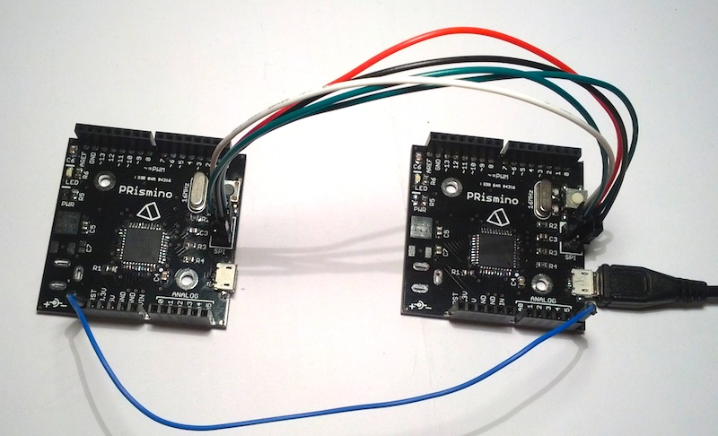

# Stand-alone ISP Programmer for Arduino

This sketch allows to load a precompiled program to the program memory of an Atmel micro-controller, it's a stand-alone project intended to program empty micro-controllers (especially bootloaders) fast and without needing a computer during production.

It needs the Arduino libraries and should in theory be compatible with all Arduino products and derivatives.

Additionally to programming the micro-controller it can change fuse bits in the process.

It has been heavily inspired by [OptiLoader][optiloader] and completely rewritten with more comments and with a couple important modifications like no SRAM usage for temporary image storage and variable image size without explicit memory allocation. This allows to store images of different size and isn't restricted to images that are smaller than the available SRAM.

Similarly to [OptiLoader][optiloader] this sketch identifies the connected micro-controller type by reading the signature bytes and searches for compatible entry. Only one image per micro-controller can be stored as the first compatible one will be used.

## Cabling for In-System Programming (ISP)

To be able to upload an image via ISP one has to connect the two micro-controllers like this:

Here two [PRisminos][prismino] are used, the left one is the target and the right is the programmer, all is powered by USB.

| MCU 1 (programmer) | MCU 2 (target)
| ------------------ | --------------
| VCC                | VCC
| GND                | GND
| SCK                | SCK
| MOSI               | MOSI
| MISO               | MISO
| A5                 | RESET

Notice the only difference is the targets `RESET` pin connected to the `A5` pin on the programmer. The blue cable goes to the `RST` pin on the Arduino headers because a male cable was needed, but the `RST` pin is also on the SPI header.

## Usage

To use the sketch one has to tell it what to do via the serial monitor, here's the list of available functions:

| Function            | Character | Description
| ------------------- | --------- | -----------
| Program memory      | `b`       | This instruction tries to identify the connected micro-controller, searches for a compatible entry in the available image array and uploads it. It checks if the reset pin is pulled high by the target before trying to communicate with it. |
| Read program memory | `r`       | Dump all program memory from 0 to the maximum program memory address to serial monitor. The program memory size is indicated in the micro-controller signature bytes. |
| Read fuse bits      | `f`       | Shows the current state of the fuse bits. |

Ex: send `b` via the serial monitor for the sketch to start programming.

For batch programming one could change the code to automatically upload the image as soon as a micro-controller is detected (via reset pin polling/interrupt, ISP polling or some other way).

### Example

An example is provided in the `image_prismino` folder, for which this sketch was originally made.

### Programming speed

By default the SPI communication is `F_CPU/128`, this sketch has been tested with a lower prescaler and it programmed much faster. A test was done with a 12KB sketch, running at 16MHz and the target running at 16MHz as well. At 8MHz the target could not be identified as the clock was way too fast. Values should be compared to the slowest programming time.

| Prescaler | SPI frequency | Programming time
| --------- | ------------- | ----------------
| 128       | 125KHz        | 2673ms
| 64        | 250KHz        | 1508ms
| 32        | 500KHz        | 932ms
| 16        | 1MHz          | 640ms
| 8         | 2MHz          | 495ms
| 4         | 4MHz          | 422ms
| 2         | 8MHz          | N/A

Note that no delays are used in the programming script, for the time sensitive operations the script polls the `RDY/BSY` flag on the target to know when to continue.

## Adding an image

To add a new image, assuming there's enough memory in the programmers program memory, simply add an `image_t` object with all the required information. The image is saved in [Intel HEX format][intelhex] in the program memory, the same you'll get by compiling it in the `.hex` file.

    // forward definition of the image_t object in "images.h"
    extern image_t PROGMEM image_prismino;

    // array of available images in main sketch file
    image_t *images[] = {&image_prismino};

    // the actual image code directly from .hex file with added quotes in "images.cpp"
    char PROGMEM prisminohex[] = {
    ":107000005FC0000078C0000076C0000074C00000BF"
    ":1070100072C0000070C000006EC000006CC00000B4"
    ":107020006AC0000068C00000C9C4000064C000005D"
    // ...
    ":107F16001000010705830210000112011001020082"
    ":107F26000008412336000100020100014341544587"
    ":067F360052494E4100001B"
    ":040000030000700089"
    ":00000001FF"
    };

    // the actual image_t image_prismino
    image_t PROGMEM prismino = {
      0x9587,                   // atmega32u4 signature bytes (see datasheet)
      {0x3F, 0xFF, 0xD8, 0xCB}, // memory protection, low, high and extended fuses when programming
      {0x2F, 0xFF, 0xD8, 0xCB}, // memory protection, low, high and extended fuses when complete
      128,                      // page size on an atmega32u4 is 128 words (see datasheet)
      prisminohex               // pointer to the actual image
    };

The important information one has to know are: the micro-controller signature bytes and page size (found in the respective datasheet) and all the fuse bits that can conveniently be calculated with the help of [this calculator][fusecalc].

Carefully read the documentation before messing with the fuse bits as wrong values can [~~irreversibly~~](https://www.google.ch/search?q=reset+avr+fuses) brick the micro-controller (especially when `SPIEN` is left unprogrammed or `RSTDISBL` is programmed).

If there isn't enough memory in the programmers program memory one can save the image in binary and merge nibbles, a Python script to refactor the code automatically is in the example image folder.

## Notes

* The sketch handles non-word-aligned code.

* The sketch assumes the image to be programmed is sequentially ordered.

* All data with a _record type_ not equal to actual data (type `0x00`) is ignored.

* Micro-controllers with more then 64KB of program memory are not supported.

* No checks are made using the checksum bits as it's assumed the image has been tested and no soft errors or single event upsets occur (don't use this code in space). Either way data is read and immediately sent to the target so there are no preliminary tests possible before it's too late.

* [Intel HEX format][intelhex] is quite inefficient here as one nibble (4 bits) is coded on a complete byte (8 bits), so if some code doesn't fit the program memory one could refactor the image code so it would take half the space.

[optiloader]: https://github.com/WestfW/OptiLoader "OptiLoader"
[avrisp]: http://www.atmel.ch/Images/doc0943.pdf "AVR910: In-System Programming"
[atmega32u4]: http://www.atmel.ch/Images/doc7766.pdf "ATmega16U4/32U4 datasheet"
[intelhex]: http://en.wikipedia.org/wiki/Intel_HEX "Intel HEX format"
[fusecalc]: http://www.engbedded.com/fusecalc "Engbedded Atmel AVR Fuse Calculator"
[prismino]: https://github.com/Robopoly/PRismino "PRismino"

## Licence

This software is published under [LGPL](http://www.gnu.org/licenses/lgpl.html).